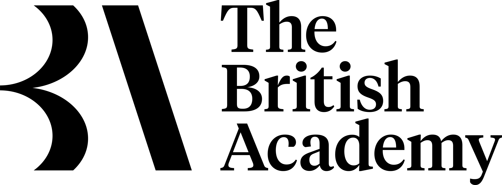

 

<h1 align=center>Researching Charity Dissolution</h1>

Welcome, this repository provides data, code and information for researching charity dissolution in multiple jurisdictions. 

It is based on the work completed during a British Academy funded project (2019-2020): *Mission Accomplished: A Cross-national Examination of Charity Dissolution*.

### Context

Encouraged by ‘open data’ movements, regulators have made it increasingly straightforward for stakeholders to access large-scale data about charities and their regulation. This project leverages some of these data resources to examine a topic of considerable public and regulatory importance: charity dissolution. This project undertakes work to collect, clean, harmonise and analyse international data on charity dissolution. In doing so we identify real opportunities for interdisciplinary collaboration to understand this important topic.

### Navigating the repository

The project website contains the most-up-date information about this work, as well as short guides on how to research this topic: [https://diarmuidm.github.io/charity-dissolution](https://diarmuidm.github.io/charity-dissolution)

The repository can be navigated as follows:
* **conferences** - papers and presentations from our participation in various nonprofit/charity conferences (2018-2019)
* **data** - links to open datasets produced by this project
* **papers** - working and conference papers documenting analysis conducted by the project team
* **syntax** - code, written in Python and Stata, for collecting, cleaning and analysing data on charity dissolution

The **images** folder is for administrative purposes and unlikely to be of interest.

### Contact:

This repository will be updated on a regular basis for the foreseeable future. If you would like to collaborate on developing the repository further, or have an idea for a research project employing these datasets, then do not hesitate to get in contact:
* [Dr Diarmuid McDonnell, University of Manchester](mailto:diarmuid.mcdonnell@manchester.ac.uk)

### Acknowledgements

We would like to thank the British Academy for providing funding for this work through its Small Research Grant scheme. We would also like to thank charity regulators for providing continually improving ways of accessing data about charities.
And finally to the charities themselves for conducting such important work.

[Dr Diarmuid McDonnell, University of Manchester](mailto:diarmuid.mcdonnell@manchester.ac.uk)  
[Professor Alasdair Rutherford, University of Stirling](https://www.stir.ac.uk/people/255778)  
[Professor Carolyn Cordery, Aston Business School](https://research.aston.ac.uk/en/persons/carolyn-j-cordery)
